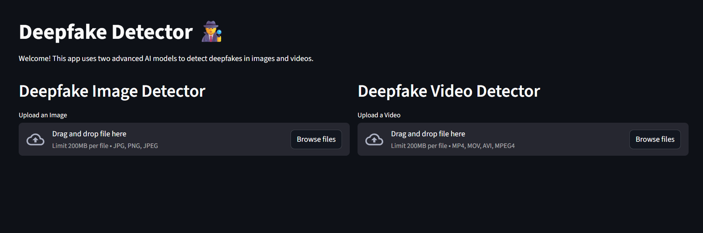
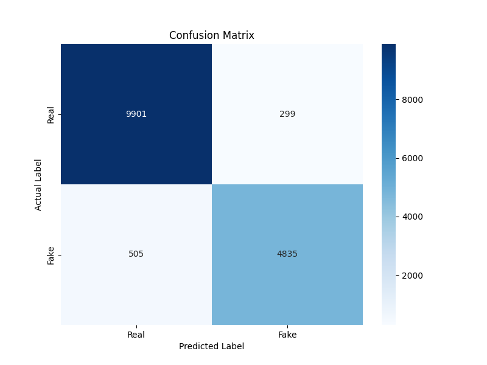
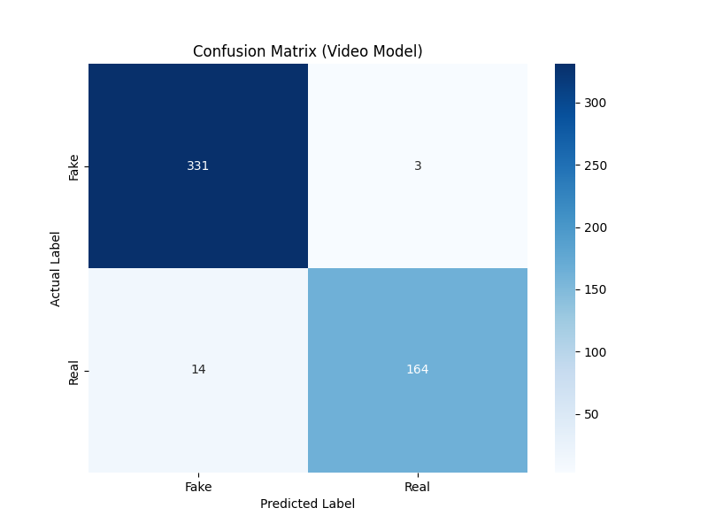

# Deepfake Detector

This project is a complete, end-to-end deepfake detection system capable of analyzing both still images and video files. It uses a dual-model architecture to provide robust predictions, wrapped in a clean, interactive web interface.



## 1. Project Goal

The objective was to build a system that could accurately distinguish between real and deepfake media. To achieve this, we developed two specialized AI models:

- **Image Detector**: A highly-tuned 2D Convolutional Neural Network (CNN) that analyzes individual frames for spatial artifacts and pixel inconsistencies common in fakes.

- **Video Detector**: A more advanced recurrent model (CNN-LSTM) that analyzes a sequence of frames to spot temporal artifacts—such as unnatural blinking, stiff facial motion, or a lack of realistic "jitter"—that are invisible in a single image.

## 2. Tech Stack

This application is built with a modern, scalable, and containerized architecture.

- **Backend**: FastAPI (Python) for a high-performance, asynchronous API server.

- **Frontend**: Streamlit (Python) for a rapid, interactive web-based UI.

- **AI/ML**: TensorFlow (Keras) for building and training the models.

- **Face Detection**: MTCNN for accurate, real-time face extraction.

- **Deployment**: Docker for containerizing the entire application (frontend, backend, and all dependencies) into a single, portable unit.

## 3. Model Architecture & Results

Two separate models were trained for specialist tasks, both starting from a pre-trained Xception base.

### Model 1: Image Detector (finetuned_model.h5)

This model is a fine-tuned Xception CNN trained on a "flat" dataset of individual, face-cropped frames. It's designed for rapid, high-accuracy analysis of still images.

- **Final Accuracy**: 94.8%
- **Final AUC**: 98.3%



*(Result from evaluate.py)*

### Model 2: Video Detector (finetuned_video_model.keras)

This is the more powerful model. It uses the "smart re-use" strategy:

- **CNN Encoder**: We "stole" the fine-tuned encoder from Model 1, which already knows how to spot deepfake artifacts on a single frame.

- **LSTM Decoder**: This encoder is wrapped in a TimeDistributed layer and fed into an LSTM (Long Short-Term Memory) network. This allows the model to analyze 30 frames in sequence and make a final prediction based on temporal patterns.

This model is far more effective at catching sophisticated fakes.

- **Final Accuracy**: 96.7%
- **Final AUC**: 99.2% (from val_auc during training)



*(Result from evaluate_video_model.py)*

## 4. How to Run This Project

You can run this application in two ways. The Docker method is highly recommended.

### Option 1: The Docker Way (Recommended)

This is the simplest and most reliable method. It builds the entire application into a self-contained "box."

**Prerequisites:**

- Git
- Docker Desktop (must be running)

```bash
# 1. Clone the repository
git clone https://github.com/hariomphogat/deep_fake_detector
cd deepfake-detector

# 2. Build the Docker container
# This will take 10-20 minutes as it installs TensorFlow and other libraries
docker build -t deepfake-detector .

# 3. Run the container
# This starts both the backend (port 8000) and frontend (port 8501)
docker run -p 8501:8501 -p 8000:8000 deepfake-detector

# 4. Open the app
# Open your web browser and go to:
# http://localhost:8501
```

### Option 2: Local Development (Manual)

This method lets you run the code directly on your machine for development.

**Prerequisites:**

- Git
- Python 3.10+

```bash
# 1. Clone the repository
git clone https://github.com/hariomphogat/deep_fake_detector
cd deepfake-detector

# 2. Create and activate a virtual environment
python -m venv .venv
# On Windows
.\.venv\Scripts\activate
# On macOS/Linux
source .venv/bin/activate

# 3. Install all dependencies
pip install -r requirements.txt

# 4. Run the Backend API (Terminal 1)
# (Leave this terminal running)
uvicorn src.main:app --host 127.0.0.1 --port 8000 --reload

# 5. Run the Frontend (Terminal 2)
# (Open a second terminal and activate .venv)
streamlit run app.py

# 6. Open the app
# Streamlit will automatically open your browser to:
# http://localhost:8501
```

## 5. Project Structure

```
deepfake_detector/
│
├── .gitignore          # Tells Git to ignore data/ and models/
├── app.py              # The Streamlit frontend code
├── Dockerfile          # Recipe to build the Docker container
├── requirements.txt    # All Python dependencies
├── start.sh            # Script to start both servers in Docker
│
├── models/             # (Not in Git) Contains .h5 model files
│   ├── finetuned_model.h5
│   └── finetuned_video_model.h5
│
├── data/               # (Not in Git) Contains all raw and processed data
│
└── src/                # All main Python source code
    ├── __init__.py     # Makes 'src' a Python package
    ├── main.py         # The FastAPI backend API
    ├── config.py       # All project paths and parameters
    │
    ├── model.py        # Defines the Keras model architecture (Image)
    ├── train.py        # Script to train the image model
    ├── finetune.py     # Script to fine-tune the image model
    ├── predict.py      # Refactored function for image prediction
    │
    ├── video_model.py  # Defines the Keras model architecture (Video)
    ├── train_video_model.py # Script to train the video model
    ├── finetune_video_model.py # Script to fine-tune the video model
    ├── predict_video_model.py # Refactored function for video prediction
    │
    ├── data_preprocessing.py     # Script for flat (image) dataset
    ├── preprocess_sequences.py   # Script for nested (video) dataset
    ├── video_data_generator.py # Custom Keras generator for video
    │
    ├── evaluate.py               # Evaluation script for image model
    └── evaluate_video_model.py   # Evaluation script for video model
```

## 6. Dataset Acknowledgement & Terms of Use

This project was trained on the Celeb-DF (v2) dataset. The use of this dataset is strictly bound by the terms provided by its authors.

**Dataset GitHub**: https://github.com/yuezunli/celeb-deepfakeforensics.git

```bibtex
@inproceedings{Celeb_DF_cvpr20,
 author = {Yuezun Li and Xin Yang and Pu Sun and Honggang Qi and Siwei Lyu},
 title = {Celeb-DF: A Large-scale Challenging Dataset for DeepFake Forensics},
 booktitle= {IEEE Conference on Computer Vision and Patten Recognition (CVPR)},
 year = {2020}}
```

## 7. Known Limitations & Future Work

**Domain Shift**: The models are highly effective on the Celeb-DF dataset but can be fooled by newer generative AI models (e.g., text-to-video from Sora, Gen-2). This is a classic "domain shift" problem.

**Future Work:**

- **Audio-Modal**: Implement an audio-detection model to run in parallel, analyzing speech patterns and audio artifacts to catch fakes (like the AI-generated teacher video) that have realistic video.

- **Broader Dataset**: Re-train the models on a more diverse dataset, including examples from modern text-to-video generators, to improve generalization.
